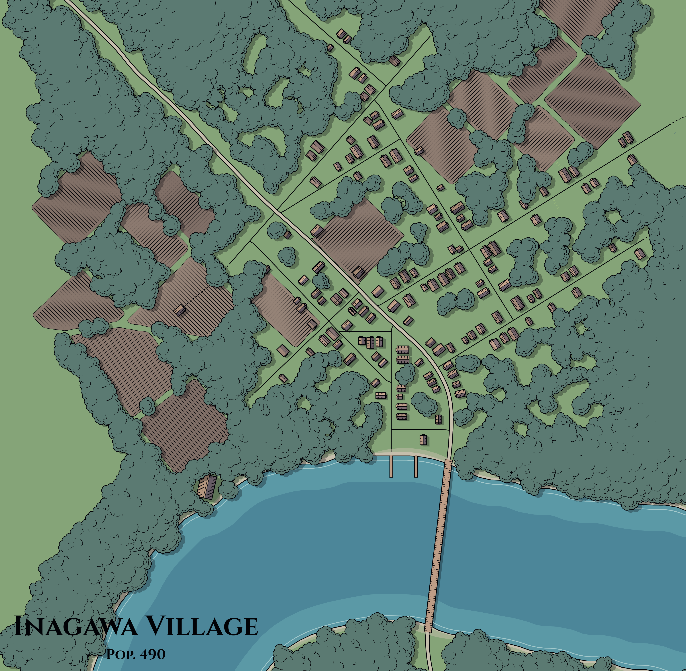

Inagawa Village

 

- Population:
    - Approximately 570; mixed human and elf.
- Government:
    - Imagawa Village is governed by the priests of the village temple.
- Notable Places:
    - The Guildhall: An impressive building of timber and brick walls, once an inn house. It contains a large meeting hall and several smaller rooms, and is shared amongst several local trade guilds.
- A few NPCs:
    - Furi Nobu: Male Human Aristocrat, Good. Nobu has a narrow face, with tangled black hair and soft gray eyes. He wears fine raiment and a dragonscale cloak. Nobu seeks revenge against the sister who betrayed him.
    - Sata Ekori: Female Elf Scofflaw, Evil. Ekori has thick gray hair and large hazel eyes. She wears well-made clothing and a wide-brimmed hat.
    - Moto Taki: Male Human Druid, Neutral. Taki has an angular face, with golden hair and light brown eyes. He wears leather armor and wields a quarterstaff and dagger. Taki seeks only fame and glory.
    - Shigeko Ishida: teenage human who works at the *Dusty Shoe Tavern*
    - Ana Ganesha: Hooded figure who aspires to be an assassin in the Kamaitachi. Evil and bloodthirsty. In their early twenties. Works as a dancer in the *Goldmoon Dance Troupe*
    - Rumen Sugiyama: Human Cleric from the affluent Sugimaya family. In their late twenties. Very prim and proper. Got sent to Inagawa Village by the main branch of the family
    - Wiggen Folkor: Kind old Gnome fisherman who loves to procrastinate. Used to be a noble before they threw it all away for a quiet lifestyle
    - Senteq Timbers: Elderly drunken gnome. A menace to all and a plague on society. Often drunk during all times of the day
