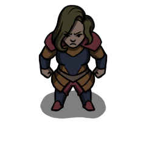

# Osanshouo

- Captain of The Crew of the Seawolf. 
- Fought for Narandaqia against Zran in the most recent conflict. The Naran-Zran war ended in the annihilation of the Narandaqia military and large land concessions. With no where else to go, Estadu turned to privateering and eventually became a captain of their own ship. 
- After teaming up with fellow misfit Estadu Ebiaque, they withdrew from Narandaqia to avoid being captured by the occupying Zran forces.